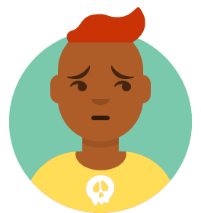
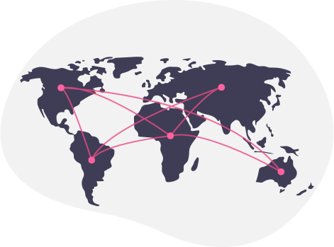

  
  <h1 class="tagline">
    FOSS Responds Together
  </h1>

  

    

      
With the recent cancellations of open source events due to COVID-19, the future of the FOSS community is unknown.  The only way to sustain our community is together, and <strong>FOSS Responders are here to help.</strong>

      
On this site, you’ll find support for those directly affected by event cancellations.  Additionally, you’ll find resources for donating, volunteering, and other ways to contribute.

      
<strong>The need is real, and the time to act is now.</strong>

    

  

  

  

    

      <h1>Need help?</h1>
      

    

  

  

    

      
      
I was going to attend a conference that was cancelled. Now I need help with the costs that the conference can’t reimburse anymore.

      <a href="https://docs.google.com/forms/d/e/1FAIpQLSeb9yPu3wuA8yklb-bdz9L6x3TLNeK1B4ws9Nf0QB473dV-_A/viewform" role="button" class="btn btn-primary link-button">
        Apply for emergency funds
        
      </a>
    

    

      
      
Our project had to cancel a small or large event and we need financial help. Without this, the project could be in real trouble!

      <a href="https://docs.google.com/forms/d/e/1FAIpQLSfncGLt7NQZIsFftsVJ-9upsXx7gYaJwJMkMgVK5ou9UIgZYw/viewform" role="button" class="btn btn-primary link-button">
        Apply for emergency funds
        
      </a>
    

  

  

    

      
      
We were relying on these events to raise funds for our project. With event cancellations, we are struggling to get donations and publicity!

      <a href="https://fossresponders.discourse.group/t/foss-crowdfunding-campaigns-that-need-your-help/61" role="button" class="btn btn-primary link-button">
        Amplify our project
        
      </a>
    

    

      
      
We rely on conferences and events to recruit new contributors and volunteers for our project. Without this we may struggle!

      <a href="https://fossresponders.discourse.group/t/foss-matchmakers-a-place-to-place-to-find-help-and-volunteer-assistance/62" role="button" class="btn btn-primary link-button">
        Recruit volunteers
        
      </a>
    

  

  

    

      
      
We cancelled our in-person event. We need to run virtual events now and we are struggling to learn how to do that!

      <a href="https://fossresponders.discourse.group/t/here-is-a-curated-list-of-remote-event-planning-resources/60" role="button" class="btn btn-primary link-button d-md-none">
        Get advice
        
      </a>
      <a href="https://fossresponders.discourse.group/t/here-is-a-curated-list-of-remote-event-planning-resources/60" role="button" class="btn btn-primary link-button d-none d-md-block">
        Advice on running my community online
        
      </a>
    

  

  

    

      
Have something else you need? Email us at <a href="mailto:foss-responders@googlegroups.com">foss-responders@googlegroups.com</a>.
      

    

  

  

  

    

      <h1>Offer help!</h1>
      

    

  

  

    

      
Now is time to give back to the projects we depend on. This is how we future-proof our open source infrastructure and help millions who built the software we benefit from.

      
Donate to the FOSS Responders Open Collective and your funds will be used to help individuals and projects who might otherwise fall through the cracks.  Open Collective waived their fees so 100% directly support those in need.

      
    

  

  

    

      
      
I’ve heard there’s open source organisations that need larger amounts of funding, I think I can help with that!

      <a href="https://fossresponders.discourse.group/t/foss-crowdfunding-campaigns-that-need-your-help/61" role="button" class="btn btn-primary link-button d-md-none">
        Help larger crowdfunds
        
      </a>
      <a href="https://fossresponders.discourse.group/t/foss-crowdfunding-campaigns-that-need-your-help/61" role="button" class="btn btn-primary link-button d-none d-md-block">
        Help larger crowdfunds for projects
        
      </a>
    

    

      
      
I can’t donate but I have time, skills or a service that I can offer an OSS project or I can help with FOSS responders!

      <a href="https://fossresponders.discourse.group/t/foss-matchmakers-a-place-to-place-to-find-help-and-volunteer-assistance/62" role="button" class="btn btn-primary link-button">
        Find a project that needs you
        
      </a>
    

  

  

    

      
      
We’ve been running online events, conferences and communities for a while and can help other orgs to get better with online activity.

      <a href="https://fossresponders.discourse.group/t/foss-matchmakers-a-place-to-place-to-find-help-and-volunteer-assistance/62" role="button" class="btn btn-primary link-button d-md-none">
        Offer your expertise
        
      </a>
      <a href="https://fossresponders.discourse.group/t/foss-matchmakers-a-place-to-place-to-find-help-and-volunteer-assistance/62" role="button" class="btn btn-primary link-button d-none d-md-block">
        Offer your expertise with online activity
        
      </a>
    

    

      
      
I can help with finding out what other conferences and events have been cancelled and their details. I love doing this kind of information gathering!

      <a href="https://airtable.com/shr5QBJUPPOQUJfND" role="button" class="btn btn-primary link-button d-md-none">
        Contribute info on events
        
      </a>
      <a href="https://airtable.com/shr5QBJUPPOQUJfND" role="button" class="btn btn-primary link-button d-none d-md-block">
        Contribute information on cancellations
        
      </a>
    

  

  

    

      
Is what you want to offer not here? Please email <a href="mailto:foss-responders@googlegroups.com">foss-responders@googlegroups.com</a>.

    

  

  

  

    

      

        

          <h1>Who we are</h1>
          
FOSS Responders is a working group of volunteers from various organizations. Our purpose is to provide a crowd-sourcing approach to help those in the open source community affected by COVID-19, especially in the face of event cancellations.

          <h2>Our mission</h2>
          <ul>
            <li class="one">Aggregate and amplify the financial and non-financial needs of FOSS communities affected by COVID-19 via our site and FOSS Funders Events, so it is easy to find who to help and how.</li>
            <li class="two">Provide emergency funds for those falling through the cracks of the traditional open source funding channels like foundation donations and membership, GitHub Sponsors, and Open Collective.</li>
            <li class="three">Create a Resource Center for projects to find tips and tricks on how to manage fully virtual community interactions, including events.</li>
          </ul>
          <a href="https://fossresponders.discourse.group/" role="button" class="btn btn-primary join-us">Join FOSS responders </a>
        

        

          
        

      

    

  

  

    

      
This working group is made up of individuals and organizations including:

      
Duane O’Brien, Megan Byrd-Sanicki, Richard Littauer, Nuritzi Sanchez, Tony Urso, Alyssa Wright, Rachel Lawson, Allen Gunn, Eriol Fox , Devon Zuegel, Jacob Redding, Ruth Suehle, Michael Cheng, Damon Gregory, Scott Moore, Shirley Bailes, Jocelyn Matthews…and more!

    

  

  

    

      

        

          
        

        

          
        

        

          
        

        

          
        

        

          
        

        

          
        

        

          
        

        

          
        

      

    

  

  

  

    

      <h1>Events</h1>
      
On May 22nd, join <a href="http://opensource.indeed.com/" target="_blank">Indeed</a>, the <a href="https://www.oscollective.org/" target="_blank">Open Source Collective</a>, and others as we come together at the first Virtual FOSS Responders Funding Event.

      
The Virtual FOSS Responders Funding Event is designed to help support the open source community through this critical time. Conference cancellations have caused financial loss, unmet fundraising trajectories, and missed business opportunities. Now is the time to participate in the sustainability of open software organizations. Now is the time to be a part of its survival.

      
If you want to participate as a FOSS Funder organization, please email <a href="mailto:foss-responders@googlegroups.com">foss-responders@googlegroups.com</a>.

      
If you are an organization who serves the free and open source software community and you have experienced financial losses due to COVID-19 please <a href="https://docs.google.com/forms/d/e/1FAIpQLSeo7NwDVs9O1JJ9cVZmypEiw50lEuot7gu3-dqOswr2dazUzg/viewform" target="_blank">apply for support</a>.

      <a href="https://opencollective.com/foss-responders/events/virtual-funding-event-q2-2020-4edd1e3a" role="button" class="btn btn-primary join-us">View info about virtual hiring events </a>
    

    

      
    

  

  

  

    

      

        

          <h1>About our programs</h1>
          <ul>
            <li class="one"><strong>Volunteer Matching:</strong> Projects need more people on deck to help during this challenging time. Visit our <a href="https://fossresponders.discourse.group/c/resources/matchmaking/7">FOSS Matchmaking Center</a> to see the list of volunteer opportunities and donate your time and talents today.</li>
            <li class="two"><strong>Amplify Project Funding Needs Online:</strong> Projects and organizations need financial support to remain sustainable during this challenging time. <a href="https://fossresponders.discourse.group/t/foss-crowdfunding-campaigns-that-need-your-help/61">See the list of needs and how you or your employer can contribute.</a></li>
            <li class="three"><strong>FOSS Funders Event:</strong> On May 22nd, 2020, we will host a <a href="https://opencollective.com/foss-responders/events/virtual-funding-event-q2-2020-4edd1e3a">FOSS Funders event</a> to connect the needs of projects and organizations to organizations with available funds.</li>
            <li class="four"><strong>FOSS Responders Fund:</strong> We provide emergency funds to community members and projects affected by COVID-19 related event cancellations and postponements. Apply today for <a href="https://docs.google.com/forms/d/e/1FAIpQLSd74U6Q082n70xlpBiZ8m2m4pj7gIsr-hL-Scli7y0yGtK9rQ/viewform?usp=sf_link">Individuals</a> and <a href="https://docs.google.com/forms/d/e/1FAIpQLSdm1op4FcFJJFPXDxwoQDK3fGnZO6hnQEbXmJcGMlaF4ZF70Q/viewform?usp=sf_link">projects</a> emergency funds or <a href="https://opencollective.com/foss-responders/donate">donate</a> to the fund today.</li>
            <li class="five"><strong>Online Community Management Resource Center:</strong> We are aggregating the many highly valuable tips and tricks shared by industry experts in our resource center. Find or share your resources <a href="https://fossresponders.discourse.group/c/resources/8">here</a>.</li>
          </ul>
        

        

          
        

      

    

  

  

  

    

      

        

          <h1>Contact</h1>
          
We're working on an FAQ page. Watch this space!

          
For now, you can always
          <!-- 
If you have questions, take a look at our FAQ.
 -->
          <!--
          TODO Design the FAQ page
          <a href="" class="btn btn-primary faqs" role="button">
            Take a look at our FAQS
            
          </a>
          
Have a question?  -->
          email us at <a href="mailto:foss-responders@googlegroups.com">foss-responders@googlegroups.com</a>.
          

        

        

          
        

      

    

  

  

